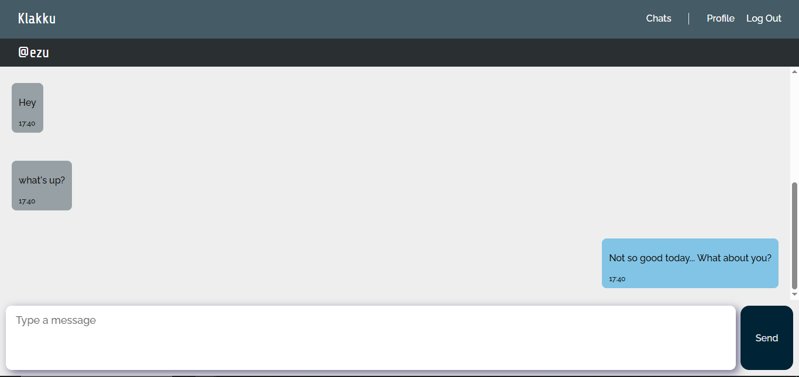

# Klakku Messenger

A real-time private chat application built with Flask, WebSockets, and SQLite.



Register, search for a username, and chat.

Developed as my final project for CS50x.

## v0.1.0 Features

* Session authentication

* Werkzeug password hashing for enhanced security

* Private conversations

* Real-time chat with any Klakku user via WebSocket

* User profiles

* Message history

* Flash notifications

* Custom interface

## About

**Klakku** is a real-time private chat application built with Flask, created to learn more about HTTP requests and web applications, inspired by CS50's 10th week, "Flask".

The main goal was to create the simplest user experience for instant messaging: by just registering and typing a recipient's username, you can start a conversation without any boring steps, such as multiple email confirmations, complex registration, or bureaucratic paths within the interface.

The project was also created to explore how the different parts of a web application communicate with each other. Instead of treating Flask as only a way to create pages, Klakku uses it as the main connection between the frontend, the database, user sessions, and the real-time communication system.

The application currently focuses on private conversations between users. Each user has a profile and can search for another Klakku user by username. After finding someone, a conversation can be started and messages can be exchanged in real time.

Klakku is intentionally simple. It is not intended to compete with large messaging platforms, but to provide a small and understandable example of how a private messaging application can be built from the ground up.

## Installation

Run the following in your terminal to clone the repository:

```powershell
git clone https://github.com/ezu1502/klakku

cd klakku
```

Install the requirements using:

```powershell
pip install -r requirements.txt
```


### Configuration
Klakku uses a secret key to securely sign Flask sessions. Before running the application, set the FLASK_SECRET_KEY environment variable.

Generate a secure key using Python:

``` powershell
python -c "import secrets; print(secrets.token_hex(32))"
```

Copy the generated value and set it as an environment variable with one of these commands:

``` powershell
$env:FLASK_SECRET_KEY="your-generated-secret-key"
```
This one sets the environment variable for a the current terminal session. You'll have to run it each time
before running the server.

``` powershell
[Environment]::SetEnvironmentVariable("FLASK_SECRET_KEY", "your-key-here", "User")
```
This one sets the variable for your Windows user account, it stays in your PC until you delete it.
(Don't forget to reload VSCode/PowerShell after running this in order to let the process have access to the variable)

**Remember: It is important to never commit your secret key to any repository or share it publicly.**


After installing the requirements, run the Flask application using Python. The application will create and use its SQLite database for storing the necessary user and conversation data.

## Built With

* Python

* Flask

* SQLite

* WebSockets

* HTML / CSS / JavaScript

## Technical Overview

Klakku's application is centered around `app.py`, which contains all of Flask's routes. The program is divided into four main sections:

* `app.py`

* `database.py`

* `templates/`

* `static/`

Each one is responsible for a different part of Klakku.

`app.py` is responsible for controlling the routes, sessions, requests, and WebSockets. It is the main entry point of the application and connects the different parts of the system.

`database.py` is the API for communication between `app.py` and SQLite. Instead of putting SQL operations directly throughout the Flask routes, database-related operations are kept in a separate class. This makes the application easier to organize and allows the database logic to be changed without having to rewrite every route.

`templates/` is the directory containing the HTML files, i.e., the visual structure for each route. The templates use Flask's templating system to display information dynamically, such as usernames, conversations, messages, and notifications.

`static/` holds the CSS/JS files, which style the pages and add logic to their elements, as well as the picture used by `index.html`'s hero section.

One of the main technical challenges in Klakku was implementing real-time communication. Normal HTTP requests work well for loading pages and sending forms, but a chat application needs a way to receive messages without constantly refreshing the page. WebSockets were used for this purpose, allowing the application to keep a connection open and exchange messages in real time.

The project also uses Flask sessions for authentication. Passwords are never stored as plain text. Instead, Werkzeug's password hashing utilities are used to create password hashes, which are stored in the database and checked during login.

## Project Structure

```text
klakku/

├── app.py

├── database.py

├── enums.py

├── helpers.py

├── README.md  <- you are here!

│

├── sql_commands/
│   └── *lots of SQLite commands*

├── static/

│   ├── hero.webp
│   ├── logic.js
│   └── style.css

│

└── templates/

    ├── base.html
    ├── chat.html
    ├── chats.html
    ├── error.html
    ├── index.html
    ├── login.html
    ├── profile.html
    └── register.html
```

The project structure is intentionally separated into different responsibilities. Flask logic, database communication, templates, static files, and SQL commands have their own locations, making the project easier to navigate and maintain as new features are added.

## Future Improvements

Although I consider Klakku to be a fairly complete web application, there is always room for improvement.

Here are some features intended for future versions:

* Profile pictures

* Customizable wallpaper

* Dark theme

* Support for LaTeX

* Media: audio messages and videos

* E2EE for privacy

* Emoticon support

* More stats in user profiles

Some of these features would require significant changes to the current architecture. For example, media messages would require a different way of handling uploaded files, while end-to-end encryption would require redesigning how messages are stored and transmitted.

## What I Learned

Klakku was also an opportunity to put several concepts together instead of learning them individually.

While building the application, I worked with Flask routes, HTTP requests, sessions, form handling, HTML templates, CSS, JavaScript, SQLite, SQL commands, password hashing, and WebSockets. I also had to think about how the frontend and backend communicate and how information should move through the application.

This made the project different from smaller exercises because a change in one part of the application could affect several other parts. Building the project helped me understand web development as a system rather than simply a collection of separate technologies.

## CS50x

Klakku was created as my final project for **Harvard University's CS50x**.

The project was designed to apply concepts learned throughout the course, while also allowing me to learn and explore Flask's API along with object-oriented programming, WebSockets logic, sessions and requests, database communication, and website design.

Rather than creating a project that only demonstrated one concept, I wanted Klakku to be something that actually behaved like a small application. It gave me the opportunity to combine the things I had learned throughout CS50x into one project.

## Author

### Eduardo Lopes Stocco - "Ezu"

Built with Python, Flask and SQLite.

Push, chop. **<u>Klakku</u>**.
